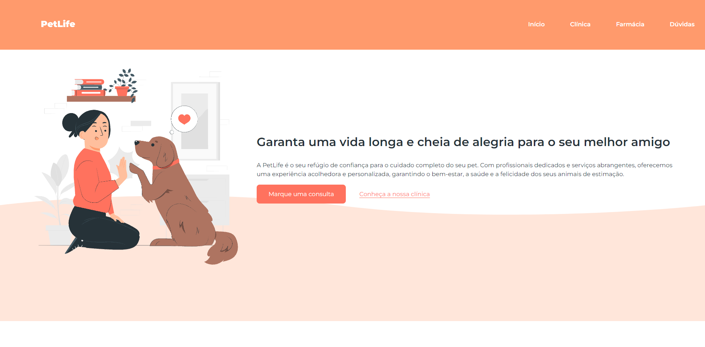

<h1 align="center"> Projeto PetLife </h1>

Projeto criado no curso de HTML, CSS e JavaScript da OnebitCode.

  <a href="#-tecnologias">Tecnologias</a>&nbsp;&nbsp;&nbsp;|&nbsp;&nbsp;&nbsp;
  <a href="#-projeto">Projeto</a>&nbsp;&nbsp;&nbsp;|&nbsp;&nbsp;&nbsp;
  <a href="#-licença">Licença</a>

  

 

  

## 🚀 Tecnologias

Esse projeto foi desenvolvido com as seguintes tecnologias:

- HTML e CSS
- JavaScript
- Git e Github
- Figma

## 💻 Projeto

O projeto PetLife é um projeto feito como um modelo de site para PetShop mostrando os serviços oferecidos. Acesse o projeto [AQUI](https://yuriverwiebe.github.io/projeto-petlife)

## 📝 Licença

Esse projeto está sob a licença MIT.

---

Feito com ♥ by Yuri Verwiebe 🌊
